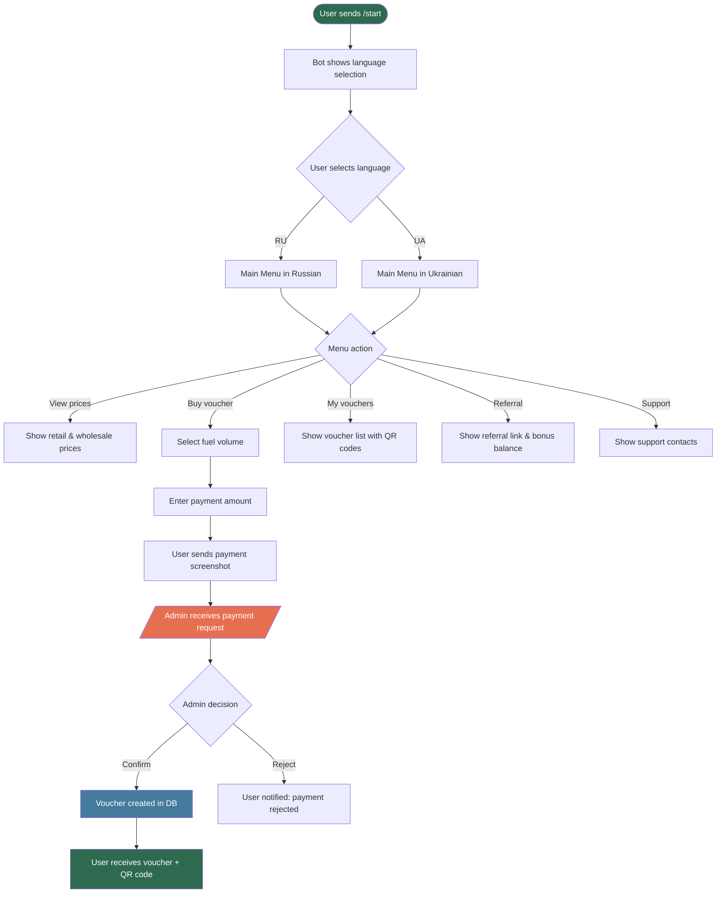

# 🤖 Telegram Bot for Fuel Voucher Sales

A full-featured Telegram bot built with aiogram 3.x for selling fuel vouchers, with manual payment confirmation by an administrator.

## 🚀 Features

### For Users:
- 💰 View current prices (retail / wholesale)
- 🛒 Purchase fuel vouchers
- 🧾 View your vouchers
- 📱 QR codes for use at the gas station
- 🎁 Referral system
- 🌐 Two-language support (Russian / Ukrainian)
- 📞 Support contacts

### For Administrators:
- ⚙️ Admin panel with full control
- ✅ Manual payment confirmation
- 📊 Sales and user statistics
- 📬 Mass message broadcasting
- 👥 User management
- 🧾 Full payment history

## 📋 Requirements

- Python 3.10+
- SQLite
- Telegram Bot Token

## 🛠 Installation

1. `git clone ... && cd fuel-talon-bot`
2. `pip install -r requirements.txt` (or run `fix_dependencies.py`)
3. Configure `.env` with `BOT_TOKEN` and `ADMIN_IDS` (use `get_my_id.py` or `setup.py`)
4. `python main.py`

## 📁 Project Structure

```
fuel-talon-bot/
├── main.py
├── config.py
├── database.py
├── handlers/
├── keyboards/
└── utils/
```

## 🗄 Database

Tables: `users`, `talons`, `payments`

## ⚙️ Configuration (`config.py`)

```python
RETAIL_PRICE = 55       # UAH/liter
WHOLESALE_PRICE = 52    # UAH/liter (from 100L)
REFERRAL_BONUS = 50     # UAH
```

## 📄 License

MIT

## 📈 Bot Workflow


